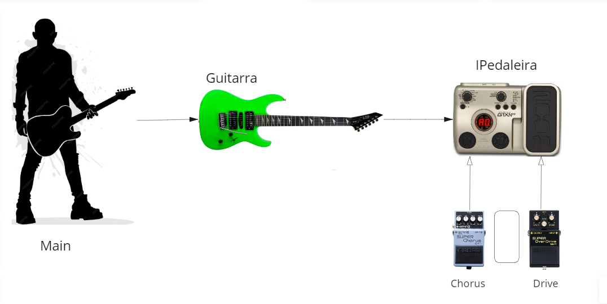
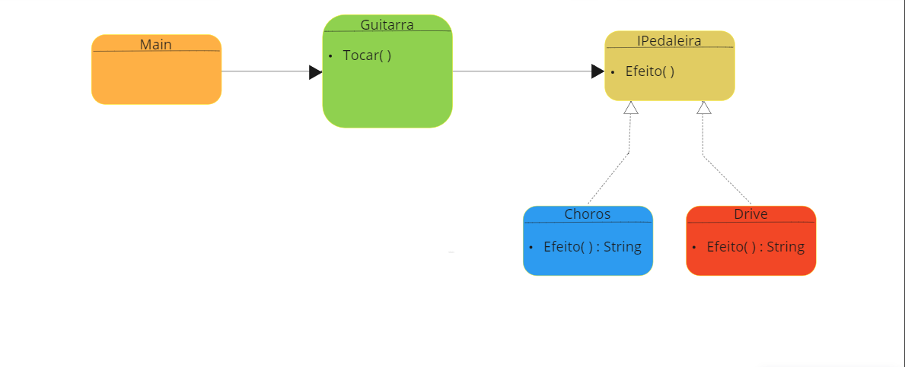
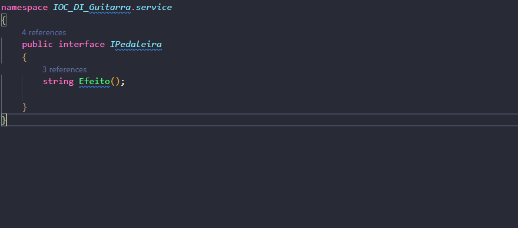
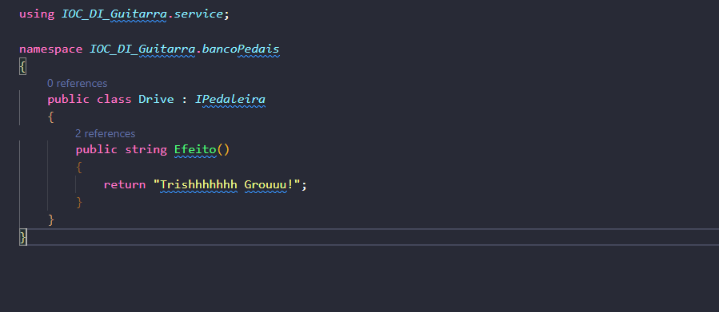
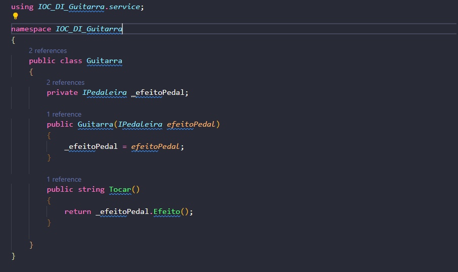
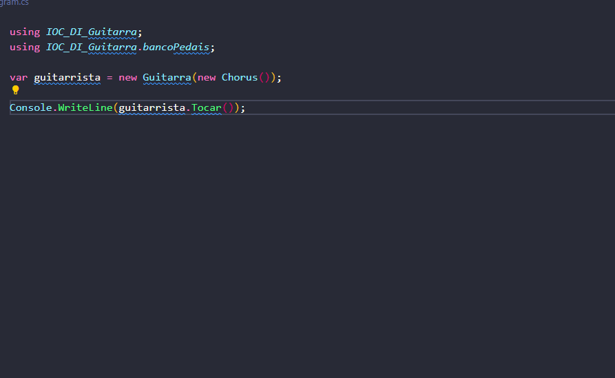

# Inversão de Controle e Injeção de Dependência na Pedaleira da Guitarra

A inversão de controle (IoC) e a injeção de dependência (DI) são conceitos fundamentais em design de software que promovem a flexibilidade e reutilização de código. Vamos explorar esses conceitos utilizando a analogia de uma pedaleira, guitarra e pedais.

## A Analogia

Na nossa analogia, a pedaleira representa a interface principal, enquanto os pedais são implementações específicas dessa interface. A guitarra, por sua vez, é o ponto onde ocorre a inversão de controle por meio da injeção de dependência.

## Inversão de Controle e Injeção de Dependência

Na guitarra, a inversão de controle é alcançada por meio da injeção de dependência. Ao invés de instanciar diretamente os pedais, a guitarra recebe a interface da pedaleira no construtor.

Isso proporciona flexibilidade, permitindo que diferentes implementações de pedais sejam facilmente conectadas à guitarra. A troca de pedais é facilitada sem a necessidade de modificar a guitarra.

## Diagrama UML

A relação entre as classes pode ser visualizada no diagrama UML abaixo:

Este diagrama representa a hierarquia de herança e a relação de composição entre `Guitarra` e `Pedaleira`.

Em resumo, a inversão de controle e a injeção de dependência proporcionam uma arquitetura mais flexível, facilitando a manutenção e a extensão do sistema.

## Interface

A interface possui apenas a assinatura do método e implementação dos métodos fica para
quem a implementa.

## Drive

Classe que possui um som peculiar distorcido e por implementar a interface pedaleira teve 
a responsabilidade de "timbrar" sua sonoridade.

## Guitarra

Essa classe recebe como construtor a injeção de depedência com a interface e assim passa a 
responsabildiade de quem a instanciar escolher qual objeto irá ser passado no construtor. 
E nessa classe é possível perceber o IoC através da DI. O seu método executa a ação de tocar e
por meio de upcasting consegue identificar qual classe deve ser chamada e assim executar o som peculiar de cada pedal.

## Main

Essa classe é quem tem o controle sobre a "Guitarra" e decide qual efeito deve ser tocado, como a 
classe guitarra passou o controle de sua instanciação para outro aqui se percebe a aplicação de IoC. E ainda percebe que caso algum pedal seja adicionado ou retirado será apenas mudado uma parte de código devido ao baixo acoplamento.

